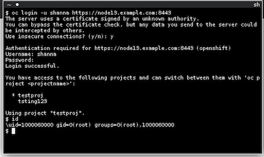

## Running a Docker image on OpenShift

In this lab you will learn to simply run a docker image on OpenShift.

**Lab #1: Running Docker image**

1. Login to https://ocp-master.ccatg.cisco.com:8443
2. Select cisco_ldap_provider under Log in with...
3. Enter your LDAP id and password
4. Click login
5. Click `New Project` button
6. Enter `username-cli` as project name. You must use your own username as part of your project name. 
7. Click `Deploy Image` tab
8. Select `openshift` / `webclient` : `latest`
Once the tag is select, OpenShift will search the image and display the details of the image.

9. Click Create at the bottom of the page
10. Click `Continue to Review` and it will bring you back to Overview page
11. Click `View Logs` under Deployment #1 to see the logs for deployment
12. Click `Events` tab to see the events that are happening within your project
13. Click `Overview` on the left nav and wait until the pod become solid blue

14. Click `Create Route` on the top right corner
15. Click `Create` button
16. Now, the route URL shows on the top right corner 
17. Click onto the route URL
18. Enter the following
    User Name: devday 
    Password: devday
19. Click `Open Terminal` at the top right corner


20.A terminal will be poped up. Enter the following in the terminal to login to OpenShift via command line interface: 

```
oc login -u <username> https://ocp-master.ccatg.cisco.com:8443 <enter>  -> y <enter> -> password <enter>
```

21. you can run any oc cli via this web console.


Congratulations!! You now know how to run docker container on OpenShift and login remotely via oc commandline interface. Get ready for more fun stuff!
