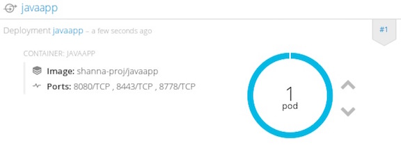
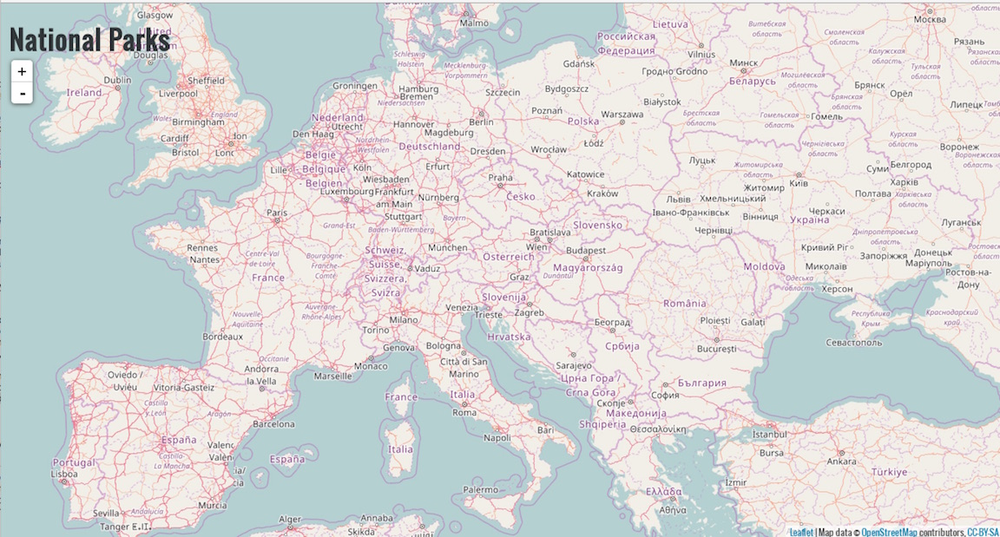

## Build and Deploy Java application 

**Background: Source-to-Image (S2I)**

Now we will expand on that a bit by learning how OpenShift builds a Docker images using source code from an existing repository.

Source-to-Image (S2I) is another open source project sponsored by Red Hat. Its goal:

```
Source-to-image (S2I) is a tool for building reproducible Docker images. S2I
produces ready-to-run images by injecting source code into a Docker image and
assembling a new Docker image which incorporates the builder image and built
source. The result is then ready to use with docker run. S2I supports
incremental builds which re-use previously downloaded dependencies, previously
built artifacts, etc.
```
OpenShift is S2I-enabled and can use S2I as one of its build mechanisms (in addition to building Docker images from Dockerfiles, and "custom" builds).

OpenShift runs the S2I process inside a special Pod, called a Build Pod, and thus builds are subject to quotas, limits, resource scheduling, and other aspects of OpenShift.

A full discussion of S2I is beyond the scope of this class, but you can find more information abuot it either in the OpenShift S2I documentation or on GitHub (following the link above). The only key concept you need to remember about S2I is that it's magic.

For a current list of supported runtimes, you can check out the OpenShift Technologies (found [here](https://www.openshift.com/container-platform/features.html#technologies)) page.


**Lab #3: Create an JAVA application that uses the JBoss EAP builder image**

We will be using a sample application called "nationalparks" (found [here](https://gitlab.com/jorgemoralespou/openshift3nationalparks)). Taking that source-code; we will use the JBoss ImageStream (or the builder image) to assemble our application.

Now create an application using the sample source-code found here https://gitlab.com/jorgemoralespou/openshift3nationalparks. 

1. From your browser, go to https://hawkular-metrics.apps.ccatg.cisco.com/hawkular/metrics, click Advance from the page and accept the cert.
2. Next, go to https://ocp-master.ccatg.cisco.com:8443
3. Select cisco_ldap_provider under Log in with...
3. Enter your LDAP id and password
4. Click login
5. Click `New Project` button
6. Enter `username-proj` as project name. You must use your own username as part of your project name. 
7. From the Browse Catalog, type `EAP`, the xPaaS options shows in the list
8. Click onto `jboss-eap64-openshift:1.3`

9. Enter javaapp as the name and https://gitlab.com/jorgemoralespou/openshift3nationalparks.git as the Git repo URL
10. Click `Create`. 
11. Click `Continue to Overview` and it will bring you back to Overview page
12. Click `Builds` --> `Builds` from the left menu
13. Click `javaapp`
14. Click `View Log` to view logs for building the application and container will show. Click the blue `follow` link on the top right corner, it will take you to the end of the logs. `Go to top` will take you back to the top of the log.
15. Click `Events` tab, you will see the events happened in the project.
16. Click `Aplication` on the left menu and click `Pods`
17. Click onto any Pod on the righ panel
18. Click `Metrics` tab to view the CPU, memory, network usages
19. Click `Details` tab, it shows all the details about the pods
20. Click `Overview` on left menu and wait for the pod become solid blue color

21. Click onto the route shows on the to to right corner

22. Congrats! your java application is now running in a container on OpenShift.


