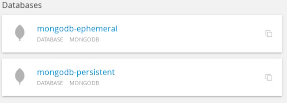
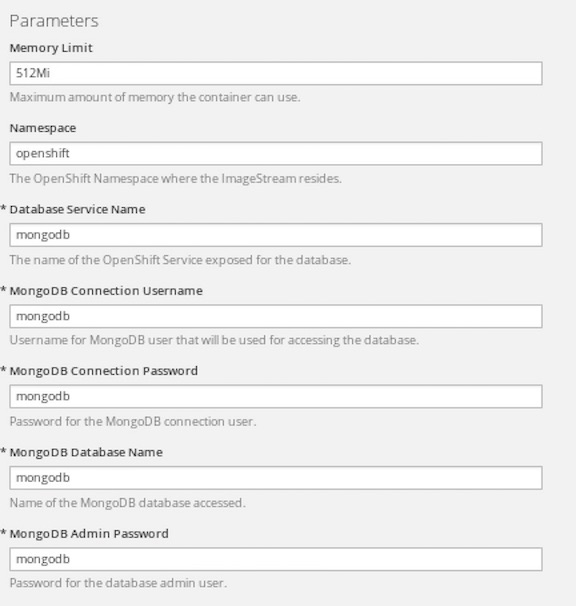
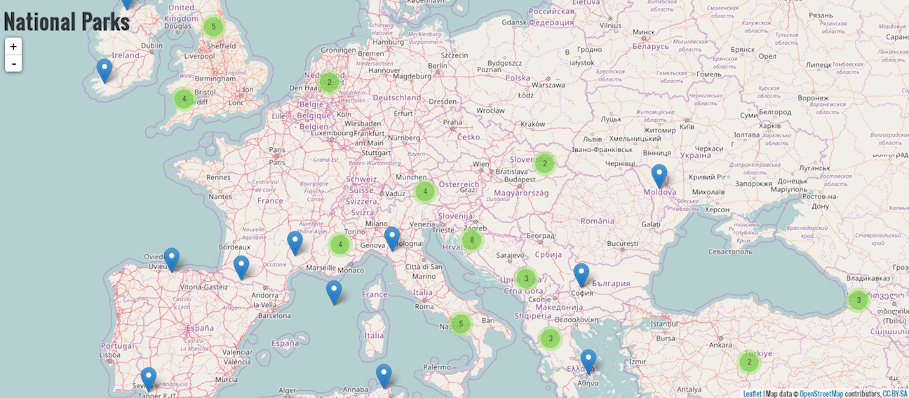

## Adding a Database 

**Background: Source-to-Image (S2I)**

Most useful applications are "stateful" or "dynamic" in some way, and this is usually achieved with a database or other data storage. In this next lab we are going to add MongoDB to our user_name-proj project and then rewire our application to talk to the database using environment variables.

We are going to use the MongoDB image that is included with OpenShift, as listed on the OpenShift Technologies page.

By default, this will use EmptyDir for data storage, which means if the Pod disappears the data does as well. In a real application you would use OpenShift's persistent storage mechanism with the database Pods to give them a persistent place to store their data.

Environment Variables
As you saw in the last lab, the web console makes it pretty easy to deploy application components as well. When we deploy the database, we need to pass in some environment variables to be used inside the container. These environment variables are required to set the username, password, and name of the database. You can change the values of these environment variables to anything you would like. The variables we are going to be setting are as follows:

- MONGODB_USER
- MONGODB_PASSWORD
- MONGODB_DATABASE

By setting these variables when creating the Mongo database, the image will ensure that:

- A database exists with the specified name
- A user exists with the specified name
- The user can access the specified database with the specified password

This exercise will walk you thought how to add a database for an application

**Lab #4: Adding a Database**

1. From your browser, go to https://ocp-master.ccatg.cisco.com:8443
2. Select cisco_ldap_provider under Log in with...
3. Enter your LDAP id and password
4. Click login if you are not login
5. Click on your project name `username-proj` that you created from Lab #3
6. Click `Add to Project` from the top menu
7. From the Browse Catalog, type `mongodb`, the Databases options shows in the list

8. Click onto `mongodb-ephemeral`
You can see that some of the fields say "generated if empty". This is a feature of Templates in OpenShift that will be covered in the next lab. For now, let's use the following values:
	* MONGODB_USER : mongodb
	* MONGODB_PASSWORD : mongodb
	* MONGODB_DATABASE: mongodb
	* MONGODB_ADMIN_PASSWORD : mongodb

9. Click `Create`
10. Click `Continue to Overview` and it will bring you back to Overview page
11. Click `View Log` in MONGODB section
12.  Click `Overview` on left menu 
13. Click `Group Service` button in the “javaapp” —> select `mongodb` from the list
14. Click `OK`
15. Now they are linked together. Click `Application` in left menus → `Deployments` 
16. Click onto `javaapp` deployment
OpenShift Container Platform deployments provide fine-grained management over applications based on a user-defined template called a deployment configuration. The deployment system in response to a deployment configuration will create a replication controller to run an application. Replication controllers are created manually or in response to triggered events.
A deployment configuration consists of the following key parts:
	* A pod template, which describes the application to be deployed.
	* The initial replica count for the replication controller.
	* deployment strategy, which will be used to deploy the application.
	* set of triggers, which cause replication controllers to be created automatically.
	* set of hooks for executing custom behavior in different points during the lifecycle of a deployment.
16. Click `Environment` tab to add environment variable and click `Add environment variable` to add more environment variables
	* MONGODB_USER : mongodb
	* MONGODB_PASSWORD : mongodb
	* MONGODB_DATABASE : mongodb
17. Click `Overview` on left menu and javaapp is alread redeploying
18. Click onto the route at the top right to test the application.

Congrats! you have added a database to your application on OpenShift.

