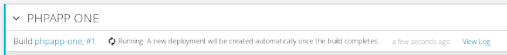
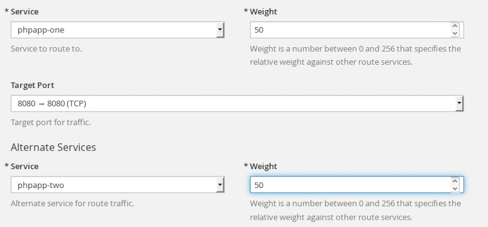
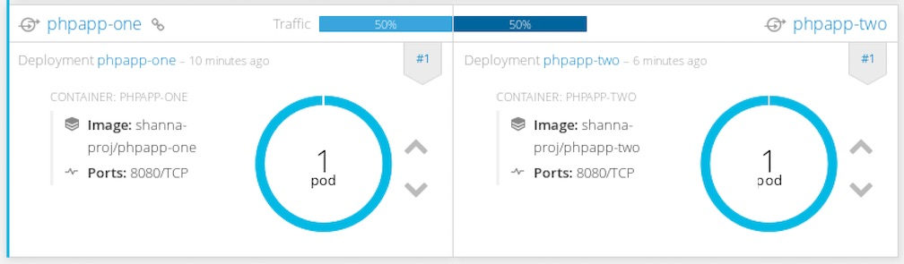

## Split Traffic 

**Load Balancing for A/B Testing**

You can run two versions of an application, and, entirely within OpenShift Container Platform, control the percentage of traffic to and from each application for A/B testing. A/B testing is a method of comparing two versions of an application against each other to determine which one performs better.

Previously, A/B testing only worked by adding or removing more pods of every kind (A or B). However, this was not a scalable solution because for lower B percentages, you would create a large number of pods. Starting in 3.3, the HAProxy router now supports splitting the traffic coming to a route across multiple back end services via weighting.


**Lab #5: Split Traffic**

1. From your browser, go to https://ocp-master.ccatg.cisco.com:8443
2. Select cisco_ldap_provider under Log in with...
3. Enter your LDAP id and password
4. Click login if you are not login
5. Click on your project name `username-proj`
6. Click `Add to Project`
7. From the Browse Catalog, type `php`
8. Select PHP 5.6
9. Add phpapp-one as Name and https://bitbucket-eng-chn-sjc1.cisco.com/bitbucket/scm/cctgdev/ocpworkshop-php.git as git repo URL.
10. Click `Continue to Overview` and it will bring you back to Overview page
11. Click `View Log` 

12. To test split traffic, we need to deploy one more php application
13. Click `Overview` on left menu 
14. 6. Click `Add to Project`
15. From the Browse Catalog, type `php`
16. Select PHP 5.6
17. Add `phpapp-two` as Name and https://github.com/piggyvenus/simplephp.git as git repo URL.
18. Click `Continue to Overview` and it will bring you back to Overview page
19. Click `View Log` 
20. Click `Overview`
21. Check the routes for both PHP apps and make sure they are working after both pods are running (the blue circle shows)
22. Go `Application` on left menu → Select `Routes`
23. Click `phpapp-one` 
24. Click `Action` on top right corner → select `Edit`
25. Click onto `Split traffic across multiple services`
26. Select the 1st service as phpapp-one with 50 weight and alternate service as phpapp-two and 50 weight

27. Click `Save`
28. Click `Overview`

29. Go to Lab #1 web console browser `http://webclient-<your_lab1_project>.apps.ccatg.cisco.com/` and run the following commands:

````
oc login -u <username> https://ocp-master.ccatg.cisco.com:8443 --> y --> enter password
oc project <username-proj>
oc get routes
oc annotate route/phpapp-one haproxy.router.openshift.io/balance=roundrobin
curl phpapp-one.<username-proj>.apps.ccatg.cisco.com 
curl phpapp-one.<username-proj>.apps.ccatg.cisco.com
````
you will notice that the response of first curl request is different from the 2nd curl request.


Congrats! you have completed Lab #5 on OpenShift.


