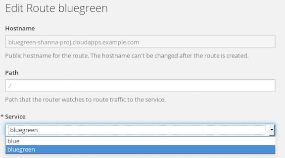

## Blue Green Deployment 

The purpose of this short lab is to demonstrate how simple it is to implement Blue-Green Deployments in OpenShift v3.

"Blue-green deployment is a release strategy that can be utilized by developers for deploying software in a production environment. Blue can be one particular production environment whereas green can define an identical production environment. Under blue-green deployment strategy, software developers are able to minimize downtime and reduce risk." 1*

In this Lab, we will be:

* Deploying two versions of the same application. The first version will display a blue rectangle.
* Create a FQDN that can be used to expose the applications.
* We will first expose the first application.
* We will also create another version of this application in the same project that displays a green rectangle.
* We will then switch the FQDN to from the first application (blue) to the second application (green)

In this exercise, you will need to fork https://bitbucket-eng-chn-sjc1.cisco.com/bitbucket/scm/cctgdev/ocpworkshop-bluegreen.git

**Lab #6: Blue Green Deployment**

1. Before you start, you will need to fork https://bitbucket-eng-chn-sjc1.cisco.com/bitbucket/scm/cctgdev/ocpworkshop-bluegreen.git git repo and enable public access from setting or forking from https://github.com/VeerMuchandi/bluegreen.git 
2. From your browser, go to https://ocp-master.ccatg.cisco.com:8443
2. Select cisco_ldap_provider under Log in with...
3. Enter your LDAP id and password
4. Click login if you are not login
5. Click on your project name `username-proj` 
6. Click Add project
7. From the Browse Catalog, type `php`
8. Select PHP 5.6
9. Add bluegreen as Name and the git repo URL that you fork from https://bitbucket-eng-chn-sjc1.cisco.com/bitbucket/scm/<your_name>/ocpworkshop-bluegreen.git in step #1
10. Click `Continue to Overview` and it will bring you back to Overview page
11. Click `View Log` -> click `follow` and wait until you see `Push successful`
12. Click `Overview`
13. Click onto the route to view the application
14. Go to bitbucket git repo that you forked it from above and edit image.php
15. toggle from one color to another color by commenting the current color and uncommenting the other line
//imagefilledrectangle($im, 0, 0, 199, 199, $blue);
imagefilledrectangle($im, 0, 0, 199, 199, $green);
16. Commit the changes
17. Go back to project `Overview`.
18. Add project → type php “filter by keyword” text box
19. Select PHP 5.6
20. Add green as Name and enter the forked reop URL as git repo URL
21. Click `Continue to overview`
22. Click `View Log`
23. Once you get the pod is up and running, the circle shows as solid blue in color
24. Click `Application` —> select `Routes`
25. Click bluegreen route
26. Click `Action` on the top right corner —> select Edit
27. Select green under services

28. Click `Save`
29. Click `Overview`
30. Click route to view the application. The route is now route to green service instead

Congrats! you have completed Lab #6 on OpenShift.

